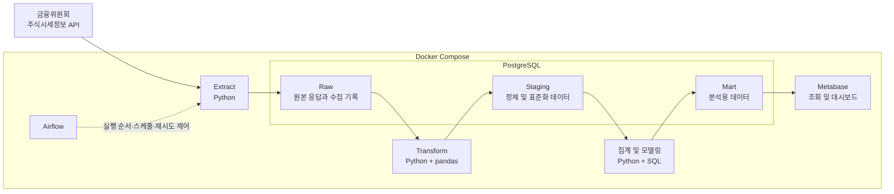

# Stock Price ETL Pipeline

금융위원회 주식시세정보 API에서 일별 주식 데이터를 수집하고, Raw·Staging·Mart 계층을 거쳐 분석 가능한 형태로 제공하는 Docker 기반 ETL 데이터 파이프라인 프로젝트이다.

## 프로젝트 목적

이 프로젝트의 목표는 주식 시세 데이터를 대상으로 데이터 수집부터 변환, 적재, 자동화, 시각화까지 이어지는 ETL 파이프라인의 전체 생명주기를 직접 구현하는 것이다.

단순히 API 응답을 데이터베이스에 저장하는 데 그치지 않고 다음 조건을 만족하는 운영 가능한 파이프라인을 만드는 것을 목표로 한다.

- Raw 계층에는 실행별 수집 이력을 보존하고, Staging과 Mart 계층에서는 고유 키와 Upsert를 통해 재실행 시 중복 데이터가 발생하지 않도록 한다.
- 원본 데이터와 가공된 데이터의 출처를 추적할 수 있다.
- 데이터의 타입, 형식, 키와 품질을 단계별로 검증한다.
- 작업 실패 원인과 실행 상태를 확인할 수 있다.
- 과거 데이터를 다시 수집하고 처리할 수 있다.
- 다른 환경에서도 동일한 방법으로 실행할 수 있다.
- 최종 데이터를 조회하고 대시보드에서 활용할 수 있다.

이 저장소에서는 **주식 시세 데이터 파이프라인 하나를 완성하는 것**만 다룬다.

데이터의 구조와 타입을 자동으로 인식하고, 인식한 결과를 바탕으로 여러 형태의 데이터를 공통 흐름으로 처리하는 범용 파이프라인은 이 프로젝트에서 얻은 경험을 기반으로 추가 진행할 예정이다.

## 현재 진행 상태

- [x] 프로젝트 목표 및 기술 스택 선정
- [x] Docker 개발 환경 구성
- [x] PostgreSQL 컨테이너 구성
- [x] Python과 PostgreSQL 연결 확인
- [x] 데이터 소스 선정 및 API 응답 분석
- [x] Raw·Staging·Mart 데이터 계층 설계
- [x] Staging 데이터의 행 기준과 고유 키 후보 선정
- [x] 데이터베이스 스키마 및 Raw 테이블 구현
- [x] Extract 구현
- [x] Raw 데이터 적재
- [ ] Transform 및 Staging 구현
- [ ] 데이터 품질 검증
- [ ] Mart 구현
- [ ] Airflow 자동화
- [ ] Metabase 시각화
- [ ] 모니터링 및 장애 처리

## 데이터 소스

- 제공 기관: 금융위원회
- 데이터명: [금융위원회_주식시세정보](https://www.data.go.kr/data/15094808/openapi.do)
- API 기능: `getStockPriceInfo`
- 제공 형식: JSON 또는 XML
- 수집 대상: KRX에 상장된 종목의 일별 시세 정보
- 주요 데이터:
  - 기준일자
  - 단축코드 및 ISIN 코드
  - 종목명 및 시장 구분
  - 시가·고가·저가·종가
  - 대비 및 등락률
  - 거래량 및 거래대금
  - 상장주식 수 및 시가총액
- 갱신 특성: 일 1회 갱신되며, 기준일자의 데이터는 다음 영업일 오후 1시 이후 제공
- 인증 정보: 공공데이터포털에서 발급받은 서비스 키를 `.env`로 관리

API 응답의 수치와 날짜 값은 문자열로 제공되므로, Staging 계층에서 목적에 맞는 PostgreSQL 타입으로 변환한다.

## 시스템 구조

다음은 이 프로젝트에서 구현할 목표 구조이다.



- Docker Compose는 Python 애플리케이션과 PostgreSQL을 포함한 서비스들의 실행 환경을 구성한다.
- Airflow는 ETL 로직 자체를 수행하는 도구가 아니라 Extract, Transform, Load 작업의 실행 순서, 스케줄, 재시도와 상태를 관리한다.
- PostgreSQL 내부에서는 Raw, Staging, Mart 스키마를 통해 데이터의 처리 단계를 구분한다.
- Metabase는 Mart 데이터를 조회하여 최종 결과를 시각화한다.

## 데이터 계층

### Raw

API 전체 응답과 수집 당시의 메타데이터를 변경하지 않고 보존하는 계층이다.

한 행은 한 번의 API 페이지 응답을 의미하며, 다음 정보를 저장한다.

- 파이프라인 실행 ID
- 요청 기준일자와 페이지 번호
- 요청 건수와 전체 응답 건수
- HTTP 상태 및 API 결과 코드
- 실제 수집 시각
- 전체 응답 Payload

구현 테이블:

```text
raw.stock_price_api_responses
```

### Staging

Raw 응답의 각 주식 종목을 관계형 데이터로 펼치고 타입, 형식, 키와 품질을 표준화하는 계층이다.

한 행의 기준은 아래와 같다.

```text
기준일자 × ISIN 코드
```

고유 키 후보:

```text
UNIQUE (base_date, isin_code)
```

날짜는 `DATE`, 정수형 가격과 거래 데이터는 `BIGINT`, 등락률은 `NUMERIC`으로 변환할 예정이다. Raw 응답의 식별자도 함께 저장하여 가공된 데이터의 출처를 추적한다.

예정 테이블:

```text
staging.stock_prices
```

### Mart

Staging 데이터를 기반으로 분석과 시각화 목적에 맞는 지표 및 집계 데이터를 제공하는 계층이다.

초기 분석 목표는 다음과 같다.

- 종목별 일별 종가 추이
- 일별 거래대금 상위 종목
- 종목별 거래량 및 등락률 변화

Mart 테이블의 행 기준과 스키마는 Staging 구현 이후 실제 대시보드 요구사항을 바탕으로 확정한다.

## 기술 스택

### 현재 적용

| 기술 | 역할 |
| --- | --- |
| Python 3.11 | 애플리케이션 및 ETL 로직 구현 |
| PostgreSQL 16 | 데이터 저장소 |
| Docker | 서비스별 실행 환경 구성 |
| Docker Compose | 애플리케이션과 PostgreSQL 실행 관리 |
| psycopg2 | Python과 PostgreSQL 연결 |
| requests | 공공데이터 API 요청 |

### 도입 예정

| 기술 | 역할 |
| --- | --- |
| pandas | 데이터 정제 및 타입 변환 |
| SQLAlchemy | 데이터베이스 접근 및 적재 보조 |
| Apache Airflow | 작업 스케줄링, 의존성, 재시도 및 실행 상태 관리 |
| Metabase | Mart 데이터 조회 및 대시보드 구성 |

## 프로젝트 구조

현재 프로젝트 구조는 다음과 같다.

```text
etl-pipeline-project/
├── app/
│   ├── extract/
│   │   └── extract.py
│   └── main.py
├── database/
│   └── init/
│       ├── 001_create_schemas.sql
│       └── 002_create_raw_tables.sql
├── docker/
│   └── Dockerfile
├── .env.example
├── .gitignore
├── docker-compose.yml
├── README.md
└── requirements.txt
```

ETL 구현을 진행하면서 Transform과 Load 모듈, Airflow DAG와 테스트 디렉터리를 추가할 예정이다.

## 실행 방법

### 1. 환경변수 파일 생성

`.env.example`을 복사하여 `.env`를 만들고 각 환경에 맞는 값을 입력한다.

```bash
cp .env.example .env
```

### 2. 컨테이너 실행

```bash
docker compose up -d
```

### 3. Python과 PostgreSQL 연결 확인

현재 `main.py`는 PostgreSQL 버전을 조회하여 데이터베이스 연결 여부를 확인한다.

```bash
docker compose exec app python main.py
```

### 4. 주식시세 데이터 수집 및 Raw 적재

현재 `extract.py`에 설정된 기준일자의 전체 페이지를 수집하고 Raw 테이블에 저장한다.

```bash
docker compose exec app python extract/extract.py
```

### 5. 로그 확인

```bash
docker compose logs -f
```

### 6. 컨테이너 종료

```bash
docker compose down
```

`docker compose down`만 실행하면 PostgreSQL 데이터가 저장된 Docker Volume은 유지된다.

## 환경변수

| 변수명 | 설명 |
| --- | --- |
| `POSTGRES_HOST` | PostgreSQL 호스트명. Compose 내부에서는 `postgres` 사용 |
| `POSTGRES_PORT` | PostgreSQL 포트 |
| `POSTGRES_DB` | 사용할 데이터베이스 이름 |
| `POSTGRES_USER` | PostgreSQL 사용자 |
| `POSTGRES_PASSWORD` | PostgreSQL 비밀번호 |
| `STOCK_API_BASE_URL` | 주식시세정보 API 기본 URL |
| `STOCK_API_SERVICE_KEY` | 공공데이터포털에서 발급받은 인증키 |

실제 `.env` 파일은 Git으로 추적하지 않는다. 저장소에는 변수명만 제공하는 `.env.example`만 포함한다.

## 향후 계획

다음 순서로 주식 시세 파이프라인을 구현한다.

1. [x] `raw`, `staging`, `mart` 스키마와 Raw 테이블 DDL 작성
2. [x] 지정한 기준일자의 전체 주식 시세 페이지 수집
3. [x] API 응답과 수집 메타데이터를 Raw 계층에 적재
4. [ ] 네트워크 오류 재시도 정책 구현
5. [ ] Raw 데이터를 검증하고 Staging 타입과 형식으로 변환
6. [ ] 고유 키와 Upsert를 적용하여 중복 적재 방지
7. [ ] 데이터 품질 검사와 실행 로그 추가
8. [ ] 분석 요구사항에 맞는 Mart 설계 및 구현
9. [ ] Python ETL 단독 실행 검증
10. [ ] Airflow DAG와 재시도 정책 구성
11. [ ] Metabase 대시보드 구성
12. [ ] 장애 상황, 재실행 및 과거 데이터 수집 검증

## 후속 학습 방향

이 저장소의 파이프라인을 완성한 뒤 별도 프로젝트에서 다음 주제를 다룰 예정이다.

- 입력 데이터의 스키마와 타입 자동 인식
- 인식 결과에 따른 표준 스키마 매핑
- 다양한 데이터 소스에 공통으로 적용할 수 있는 수집 및 처리 흐름
- 자동 추론 결과에 대한 데이터 계약과 품질 검증
