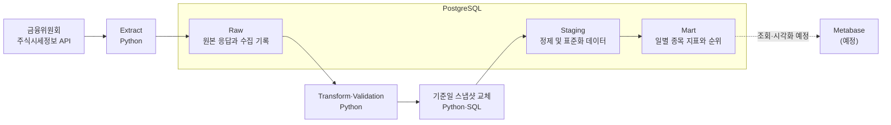

# Stock Price ETL Pipeline

금융위원회 주식시세정보 API에서 일별 주식 데이터를 수집하고, Raw·Staging·Mart 계층을 거쳐 분석 가능한 형태로 제공하는 Docker 기반 ETL 데이터 파이프라인 프로젝트이다.

## 프로젝트 목적

이 프로젝트의 목표는 주식 시세 데이터를 대상으로 데이터 수집부터 변환, 적재, 자동화, 시각화까지 이어지는 ETL 파이프라인의 전체 생명주기를 직접 구현하는 것이다.

단순히 API 응답을 데이터베이스에 저장하는 데 그치지 않고 다음 조건을 만족하는 운영 가능한 파이프라인을 만드는 것을 목표로 한다.

- Raw 계층에 실행별 수집 이력과 원본 API 응답을 보존한다.
- Staging과 Mart 계층은 기준일 단위로 교체하여 재수집 결과에 없는 과거 행이 남지 않도록 한다.
- 원본 데이터와 가공된 데이터의 출처를 추적할 수 있다.
- 데이터의 타입, 형식, 키와 품질을 단계별로 검증한다.
- 작업 실패 시 트랜잭션을 Rollback하고 오류 원인을 확인할 수 있다.
- 과거 데이터를 다시 수집하고 처리할 수 있다.
- 다른 환경에서도 동일한 방법으로 실행할 수 있다.
- 최종 데이터를 조회하고 대시보드에서 활용할 수 있다.

이 저장소에서는 **금융위원회 주식시세정보 데이터를 처리하는 단일 파이프라인을 완성하는 것**만 다룬다.

데이터 구조와 타입을 자동으로 인식하고 여러 형태의 데이터를 공통 흐름으로 처리하는 범용 파이프라인은 이 프로젝트에서 얻은 경험을 바탕으로 별도 저장소에서 진행할 예정이다.

## 현재 진행 상태

- [x] 프로젝트 목표 및 기술 스택 선정
- [x] Docker 기반 Python·PostgreSQL 개발 환경 구성
- [x] 데이터 소스 선정 및 API 응답 분석
- [x] Raw·Staging·Mart 데이터 계층 설계
- [x] Raw·Staging·Mart 스키마 구현
- [x] 지정 기준일의 전체 API 페이지 수집
- [x] API 응답과 수집 메타데이터 Raw 적재
- [x] Raw 응답 item 추출 및 타입 변환
- [x] 필수값·중복·값 범위 데이터 검증
- [x] Staging 기준일 스냅샷 교체 구현
- [x] Raw → Transform → Validation → Staging → Mart 통합 실행
- [x] 재수집 정합성 및 트랜잭션 멱등성 검증
- [x] 코드 구조 정리 및 단위 테스트
- [x] 데이터 품질 검증 확장
- [x] PostgreSQL 통합 테스트 및 테스트 DB 자동화
- [x] Mart 설계 및 구현
- [x] 기간 Backfill 실행 지원
- [x] Airflow Docker 실행 환경 및 Metadata DB 구성
- [ ] Airflow DAG 구성
- [ ] Metabase 대시보드 구성
- [ ] 모니터링, 장애 및 재시도 테스트

## 데이터 소스

- 제공 기관: 금융위원회
- 데이터명: [금융위원회_주식시세정보](https://www.data.go.kr/data/15094808/openapi.do)
- API 기능: `getStockPriceInfo`
- 제공 형식: JSON 또는 XML
- 수집 대상: KRX에 상장된 종목의 일별 시세 정보
- 갱신 특성: 일 1회 갱신되며, 기준일자의 데이터는 다음 영업일 오후 1시 이후 제공
- 인증 정보: 공공데이터포털에서 발급받은 서비스 키를 `.env`로 관리

주요 수집 항목은 다음과 같다.

- 기준일자
- 단축코드 및 ISIN 코드
- 종목명 및 시장 구분
- 시가·고가·저가·종가
- 대비 및 등락률
- 거래량 및 거래대금
- 상장주식 수 및 시가총액

API 응답의 날짜와 수치 값은 문자열로 제공되므로 Staging 계층에 적재하기 전에 PostgreSQL 타입에 맞게 변환한다.

## 시스템 구조

현재 구현된 데이터 흐름은 다음과 같다.



- Docker Compose는 Python 애플리케이션과 PostgreSQL의 실행 환경을 구성한다.
- Extract는 외부 API를 페이지 단위로 호출하고 전체 응답을 Raw 계층에 저장한다.
- 통합 실행 코드는 API 수집부터 Raw·Staging·Mart 적재와 품질 검증까지 수행한다.
- Airflow는 이후 Extract, Transform, Load의 실행 순서, 스케줄, 재시도와 상태를 관리할 예정이다.
- Metabase는 Mart 데이터를 조회하여 최종 결과를 시각화할 예정이다.

현재 `main.py`는 Extract부터 Staging Load와 품질 검증까지 한 번에 실행한다.

## 데이터 계층

### Raw

API 전체 응답과 수집 당시의 메타데이터를 변경하지 않고 보존하는 계층이다.

한 행은 한 번의 API 페이지 응답을 의미하며 다음 정보를 저장한다.

- 파이프라인 실행 ID
- 요청 기준일자와 페이지 번호
- 요청 건수와 전체 응답 건수
- 현재 페이지의 실제 item 수
- HTTP 상태와 API 결과 코드
- 실제 수집 시각
- 전체 API 응답 Payload

구현 테이블:

```text
raw.stock_price_api_responses
```

동일 실행 내 중복 페이지 저장을 막는 고유 키:

```text
run_id × requested_base_date × page_no
```

### Staging

Raw 응답의 각 주식 종목을 관계형 데이터로 펼치고 타입, 형식, 키와 품질을 표준화하는 계층이다.

구현 테이블:

```text
staging.stock_prices
```

한 행의 기준 및 기본 키:

```text
base_date × isin_code
```

주요 처리 내용:

- `YYYYMMDD` 문자열을 `DATE`로 변환
- 가격, 거래량, 거래대금 및 시가총액을 `BIGINT`로 변환
- 등락률을 `NUMERIC`으로 변환
- 필수값, 중복 키, 음수 불가 값 및 고가·저가 관계 검증
- `source_response_id`를 통한 Raw 페이지 출처 추적
- 같은 기준일의 Mart와 Staging 데이터를 삭제한 뒤 신규 결과를 일괄 삽입
- 교체 작업은 하나의 트랜잭션에서 수행하여 실패 시 기존 스냅샷을 복원

### Mart

Staging 데이터를 기반으로 분석과 시각화 목적에 맞는 지표 및 순위를 제공하는 계층이다.

구현 테이블:

```text
mart.daily_stock_rankings
```

한 행의 기준 및 기본 키:

```text
base_date × isin_code
```

현재 제공하는 분석 값은 다음과 같다.

- 시가 대비 종가의 장중 가격 변화와 변화율
- 상승·하락·보합 방향
- 상승·하락 그룹별 변동률 순위
- 일별 거래량 순위
- 일별 거래대금 순위

## 기술 스택

### 현재 적용

| 기술 | 역할 |
| --- | --- |
| Python 3.11 | ETL 로직 및 통합 실행 구현 |
| PostgreSQL 16 | Raw·Staging·Mart 데이터 저장소 |
| Docker | 서비스별 실행 환경 구성 |
| Docker Compose | Python 애플리케이션과 PostgreSQL 실행 관리 |
| requests | 공공데이터 API 요청 |
| psycopg2 | PostgreSQL 연결, 트랜잭션 및 Batch Insert |
| python-dotenv | 로컬 환경변수 로딩 |
| pytest | 단위 및 PostgreSQL 통합 테스트 |
| Apache Airflow 3.3.0 | LocalExecutor 기반 스케줄링 실행 환경 |

### 의존성에 포함됐지만 아직 사용하지 않음

| 기술 | 예정 역할 |
| --- | --- |
| pandas | 필요 시 데이터 정제 및 분석 처리 보조 |
| SQLAlchemy | 필요 시 데이터베이스 접근 계층 보조 |

### 도입 예정

| 기술 | 역할 |
| --- | --- |
| Metabase | Mart 데이터 조회 및 대시보드 구성 |

## 프로젝트 구조

현재 프로젝트 구조는 다음과 같다.

```text
etl-pipeline-project/
├── app/
│   ├── extract/
│   │   └── extract.py
│   ├── transform/
│   │   └── transform.py
│   ├── load/
│   │   └── load.py
│   ├── quality/
│   │   ├── exceptions.py
│   │   └── validators.py
│   └── main.py
├── database/
│   └── init/
│       ├── 001_create_schemas.sql
│       ├── 002_create_raw_tables.sql
│       ├── 003_create_staging_tables.sql
│       └── 004_alter_stock_price_short_code_constraint.sql
├── docker/
│   ├── Dockerfile
│   ├── airflow.Dockerfile
│   └── airflow-requirements.txt
├── dags/
├── config/
├── scripts/
│   └── test-postgres.sh
├── tests/
│   ├── integration/
│   │   └── test_postgres_pipeline.py
│   └── test_*.py
├── .env.example
├── .gitignore
├── docker-compose.yml
├── docker-compose.test.yml
├── pytest.ini
├── README.md
└── requirements.txt
```

## 실행 방법

### 1. 환경변수 파일 생성

`.env.example`을 복사하여 `.env`를 만들고 각 환경에 맞는 값을 입력한다.

```bash
cp .env.example .env
```

### 2. Airflow 초기화

최초 실행 시 Airflow Metadata DB migration과 관리자 계정 생성을 수행한다.

```bash
docker compose build airflow-init
docker compose up airflow-init
```

`airflow-init exited with code 0`이 출력되면 초기화가 완료된 것이다. 관리자 계정은 `.env`의 `AIRFLOW_ADMIN_USERNAME`과 `AIRFLOW_ADMIN_PASSWORD`로 설정한다. 두 값을 지정하지 않은 로컬 개발 환경의 기본값은 각각 `airflow`이다.

### 3. 컨테이너 실행

```bash
docker compose up -d
docker compose ps
```

다음 장기 실행 서비스가 모두 `healthy` 또는 `Up` 상태인지 확인한다.

- `etl-app`, `etl-postgres`
- `airflow-postgres`
- `airflow-api-server`
- `airflow-scheduler`
- `airflow-dag-processor`
- `airflow-triggerer`

Airflow UI는 [http://localhost:8080](http://localhost:8080)에서 확인한다. 현재 Airflow 실행 환경만 구성되어 있으며 실제 주식시세 DAG는 후속 작업에서 추가한다.

PostgreSQL 초기화 SQL은 데이터 볼륨을 처음 생성할 때만 자동 실행된다. 기존 볼륨에 새 변경 SQL을 추가한 경우 해당 SQL을 별도로 적용해야 한다.

### 4. ETL 및 품질 검증 통합 실행

단일 기준일을 실행할 때는 수집 기준일과 페이지당 요청 건수를 전달한다.

```bash
docker compose exec app python main.py \
  --base-date "20230601" \
  --num-of-rows 100
```

기간을 Backfill할 때는 시작일과 종료일을 함께 전달한다. 시작일과 종료일을 모두 포함하여 날짜별로 순차 실행한다.

```bash
docker compose exec app python main.py \
  --base-date "20230601" \
  --end-date "20230630" \
  --num-of-rows 100
```

통합 실행은 다음 순서로 동작한다.

```text
API 전체 페이지 수집 및 Raw 적재
→ Raw 배치 품질 검증
→ Raw Commit
→ item 추출
→ 컬럼명 및 타입 변환
→ 변환 데이터 품질 검증
→ 기존 Mart 기준일 데이터 삭제
→ 기존 Staging 기준일 데이터 삭제
→ Staging Batch Insert 및 품질 검증
→ Mart 생성 및 품질 검증
→ Staging·Mart Commit
```

Raw 단계 실패 시 Raw 트랜잭션을 Rollback한다. 이후 단계가 실패하면 같은 트랜잭션에서 수행한 Mart 삭제, Staging 삭제와 신규 적재를 모두 Rollback하여 이전 스냅샷을 유지한다.

API가 정상 응답했지만 item이 0건인 날짜는 Raw 수집 이력만 보존하고 기존 Staging·Mart 데이터는 삭제하지 않는다. 기간 실행 중 한 날짜가 실패하면 그 날짜는 Rollback하고 실행을 중단하며, 앞선 날짜에서 이미 완료된 결과는 유지한다.

### 5. 단위 테스트

```bash
pytest -q
```

로컬 단위 테스트에서는 실제 PostgreSQL 통합 테스트를 자동으로 건너뛴다.

### 6. PostgreSQL 통합 테스트

```bash
./scripts/test-postgres.sh
```

이 명령은 다음 작업을 자동으로 수행한다.

- `etl_test_db` 테스트 전용 PostgreSQL 컨테이너 실행
- `database/init/001~005` DDL 적용
- 전체 단위 테스트와 PostgreSQL 통합 테스트 실행
- 기준일 스냅샷 교체와 제약조건 실패 시 Rollback 검증
- 테스트 종료 후 컨테이너, 네트워크와 임시 DB 삭제

테스트 DB는 호스트의 `5434` 포트를 사용하며 개발 DB의 데이터와 Volume을 공유하지 않는다.

### 7. 적재 결과 확인

```sql
SELECT
    COUNT(*) AS row_count,
    COUNT(DISTINCT (base_date, isin_code)) AS unique_row_count,
    COUNT(DISTINCT source_response_id) AS source_page_count
FROM staging.stock_prices
WHERE base_date = '2023-06-01';
```

검증에 사용한 2023년 6월 1일 데이터의 결과는 다음과 같다.

```text
Raw 페이지 수: 28
API 전체 item 수: 2,720
Staging 행 수: 2,720
Raw 출처 페이지 수: 28
```

같은 기준일을 재수집하면 Staging과 Mart가 최신 수집 결과로 교체되며, 이전 수집에만 존재했던 종목은 남지 않는다.

### 8. 로그 확인

```bash
docker compose logs -f
```

Airflow 서비스만 확인할 때는 다음처럼 서비스 이름을 지정할 수 있다.

```bash
docker compose logs -f \
  airflow-api-server \
  airflow-scheduler \
  airflow-dag-processor \
  airflow-triggerer
```

### 9. 컨테이너 종료

```bash
docker compose down
```

`docker compose down`만 실행하면 ETL PostgreSQL과 Airflow Metadata DB의 Docker Volume은 유지된다. `docker compose down --volumes`를 실행하면 두 데이터베이스의 데이터가 모두 삭제되므로 주의한다.

## 환경변수

| 변수명 | 설명 |
| --- | --- |
| `POSTGRES_HOST` | PostgreSQL 호스트명. Compose 내부에서는 `postgres` 사용 |
| `POSTGRES_PORT` | PostgreSQL 포트 |
| `POSTGRES_DB` | 사용할 데이터베이스 이름 |
| `POSTGRES_USER` | PostgreSQL 사용자 |
| `POSTGRES_PASSWORD` | PostgreSQL 비밀번호 |
| `STOCK_API_BASE_URL` | 주식시세정보 API 기본 URL |
| `STOCK_API_SERVICE_KEY` | 공공데이터포털에서 발급받은 인증키 |
| `AIRFLOW_UID` | Airflow 컨테이너 실행 사용자 ID. 기본값 `50000` |
| `AIRFLOW_POSTGRES_DB` | Airflow Metadata DB 이름 |
| `AIRFLOW_POSTGRES_USER` | Airflow Metadata DB 사용자 |
| `AIRFLOW_POSTGRES_PASSWORD` | Airflow Metadata DB 비밀번호 |
| `AIRFLOW_ADMIN_USERNAME` | Airflow UI 관리자 계정명 |
| `AIRFLOW_ADMIN_PASSWORD` | Airflow UI 관리자 비밀번호 |
| `AIRFLOW_FERNET_KEY` | Airflow Connection 등 암호화에 사용하는 키 |
| `AIRFLOW_API_JWT_SECRET` | Airflow 내부 Execution API JWT 서명 키 |

실제 `.env` 파일은 Git으로 추적하지 않는다. 저장소에는 변수명만 제공하는 `.env.example`만 포함한다.

## 현재 제약사항

- 외부 API 호출 재시도 정책이 아직 없다.
- Airflow 실행 환경은 구성됐지만 ETL DAG와 스케줄 정책은 아직 없다.
- DB 초기화 SQL과 기존 DB 변경을 위한 마이그레이션이 분리되어 있지 않다.
- 실행 로그가 표준 출력으로만 제공된다.

## 향후 계획

다음 순서로 프로젝트를 확장한다.

1. 환경설정 및 데이터베이스 연결 코드 분리
2. Airflow DAG와 재시도 정책 구성
3. Metabase 대시보드 구성
4. 모니터링과 장애 테스트
5. 프로젝트 트러블슈팅과 설계 결정 문서화
